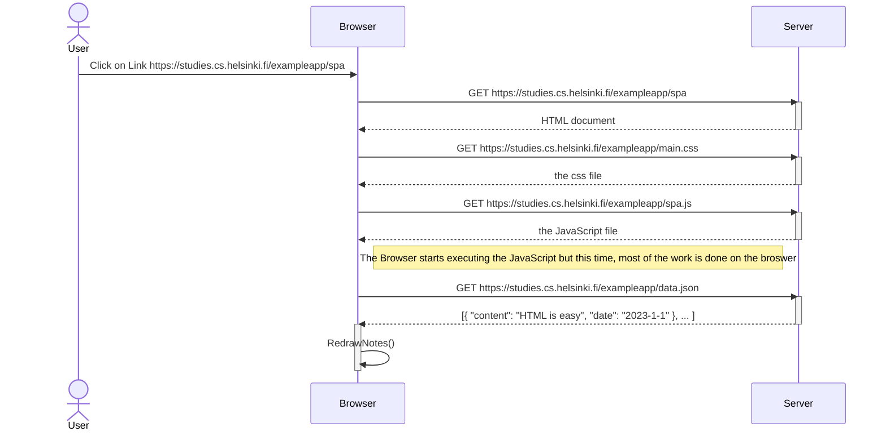

```mermaid

sequenceDiagram

actor User
participant Browser
participant Server

User->>Browser: Click on Link https://studies.cs.helsinki.fi/exampleapp/spa


Browser->>Server: GET https://studies.cs.helsinki.fi/exampleapp/spa
activate Server
Server-->>Browser: HTML document
deactivate Server

Browser->>Server: GET https://studies.cs.helsinki.fi/exampleapp/main.css
activate Server
Server-->>Browser: the css file
deactivate Server

Browser->>Server: GET https://studies.cs.helsinki.fi/exampleapp/spa.js
activate Server
Server-->>Browser: the JavaScript file
deactivate Server

Note right of Browser: The Browser starts executing the JavaScript but this time, most of the work is done on the broswer

Browser->>Server: GET https://studies.cs.helsinki.fi/exampleapp/data.json
activate Server
Server-->>Browser: [{ "content": "HTML is easy", "date": "2023-1-1" }, ... ]
deactivate Server

activate Browser
Browser->>Browser: RedrawNotes()
deactivate Browser


```