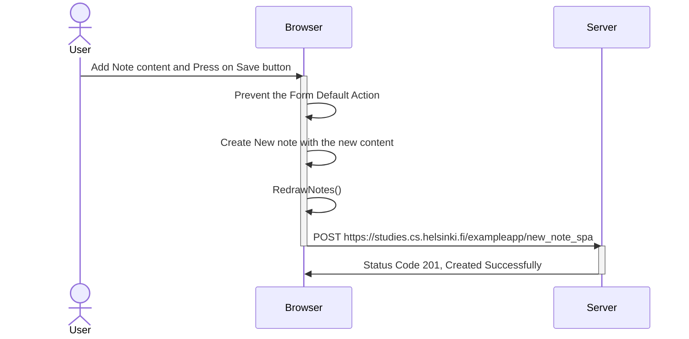

```mermaid

sequenceDiagram

actor User
participant Browser
participant Server

User->>Browser: Add Note content and Press on Save button
activate Browser
Browser->>Browser: Prevent the Form Default Action
Browser->>Browser:Create New note with the new content
Browser->>Browser: RedrawNotes()


Browser->>Server: POST https://studies.cs.helsinki.fi/exampleapp/new_note_spa
deactivate Browser
activate Server
Server->>Browser: Status Code 201, Created Successfully 
deactivate Server

```